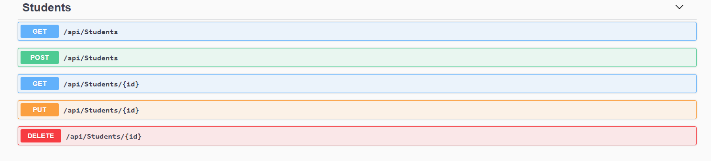
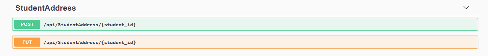
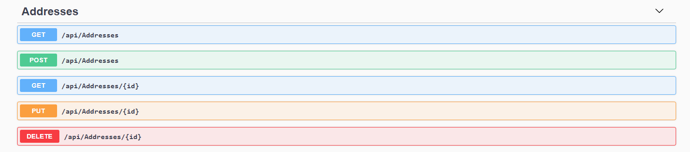
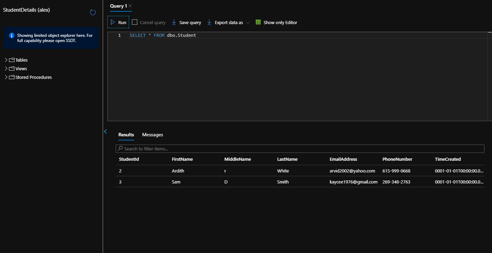
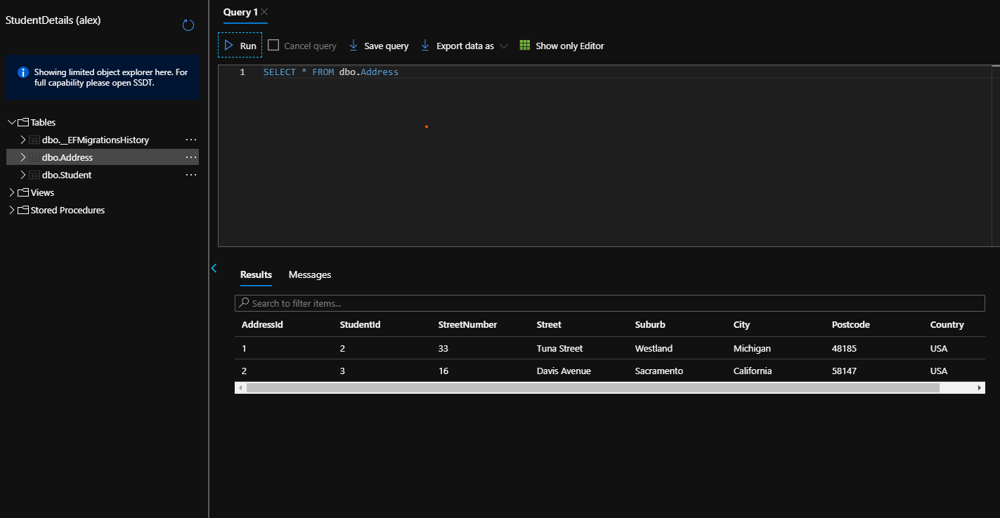
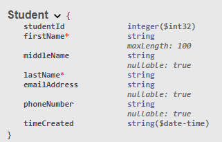
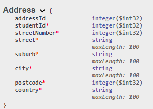

# Student-API

Created for the Database/API component of MSA Phase 1

## Deployed App
The API is running on an Azure app service and it can be accessed here: https://msa-sims-student.azurewebsites.net/index.html

## API Endpoints
### Student Endpoints
The student endpoints include all basic CRUD operations as well as an endpoint to retreive all students.

*Screenshot of student endpoints*

### Student Address Endpoints
These endpoints allow an address to be created and edited by providing the id of the associated student

### Address Endpoints
The address endpoints include all basic CRUD operations as well as an endpoint to retreive all addresses. There is also an additional endpoint which allows an address to be fetched via the ID of the associated student

*Screenshot of address endpoints*

## SQL Database
The SQL Database has two tables, one for students and one for addresses. Below are screenshows showing example data in each of these tables:

**Student table with example data**

**Address table with example data**

## Schemas
### Student Schema

### Address Schema

### Relationships
There is a one-to-many relationship between students and addresses. This is implemented through the student id field in the address schema as show above. This allows any number of addresses to reference the same student, but keeping it as a single property means the address can only store a reference to exactly one student, enforcing the one-to-many relationship.
